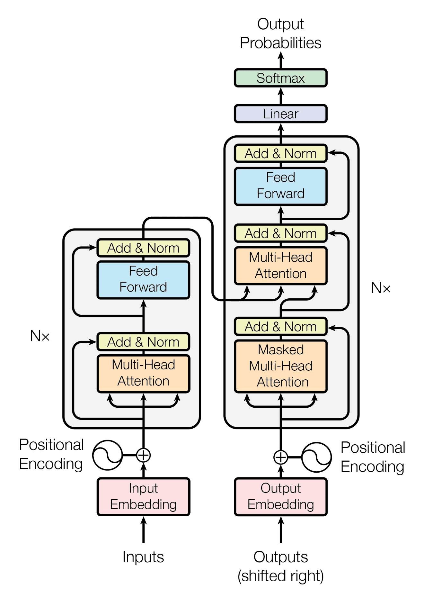

# Text Embeddings
## A Practical Overview

 

### [Douglas Hanley](http://doughanley.com)
### University of Pittsburgh + [Compendium Labs](http://compendiumlabs.ai)

 

##### OnX Maps Guest Lecture, 2024

[doughanley.com/embed](http://doughanley.com/embed)  <!-- .element style="color: #ff0d57" -->

---

## Text Vectorization

**Word frequency (bag of words)**: identify relevant words (vocabulary) and produce a (very sparse) vector of counts/frequencies
- A common embellishment is to re-weight word frequencies by the inverse document frequency of a given token (TF-IDF)

**Text embeddings**: are a dimensionality reduction technique that converts words or documents into numerical representations
- Result is a high dimensional vector for each chunk of text (e.g. OpenAI offers models from 256 to 3072 dimensions)

**Token**: the fundamental "word" unit, in the simplest case literally a word, but in more advanced settings either n-grams ("running shoes") or sub-word tokens ("up"-"grade")

---

## Transformer Architecture

Transformers are the dominant class of large language model (LLM) today and are most notably used for ChatGPT and other models like LLaMa

They have undergone massive improvements in architecture, training, and implementation since first proposed in 2017

Here we just use the (first) embedding layer, buy we would expect more advanced models to have more sophisticated embeddings

Transformer Architecture

---

## Visualizing Embeddings

Let's get a more intuitive idea of what these embeddings express and how indicative they are of topic

We can also use **dimensionality reduction** techniques such as principle component analysis (PCA), t-SNE, or UMAP

Here is a 2D UMAP representation of the OpenAI embeddings for every presidential inaugural $\rightarrow$

<iframe src="images/umap_inaug.html" width="520" height="520" scrolling="no"></iframe>

---

## Interactive UMAP (US Patents)

<iframe src="images/umap_patents.html" width="810" height="520"></iframe>

[Patents UMAP](umap_patents.html)

---

  

**Text Embeddings**  
**A Practical Overview**

Douglas Hanley

*University of Pittsburgh + Compendium Labs*

  

US patent embeddings $\rightarrow$

 

<iframe src="images/umap_patents.html" width="810" height="520" scrolling="no"></iframe>

