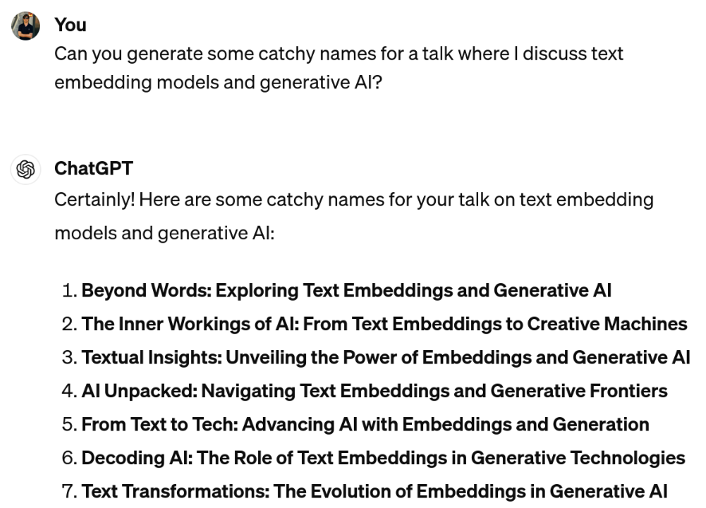
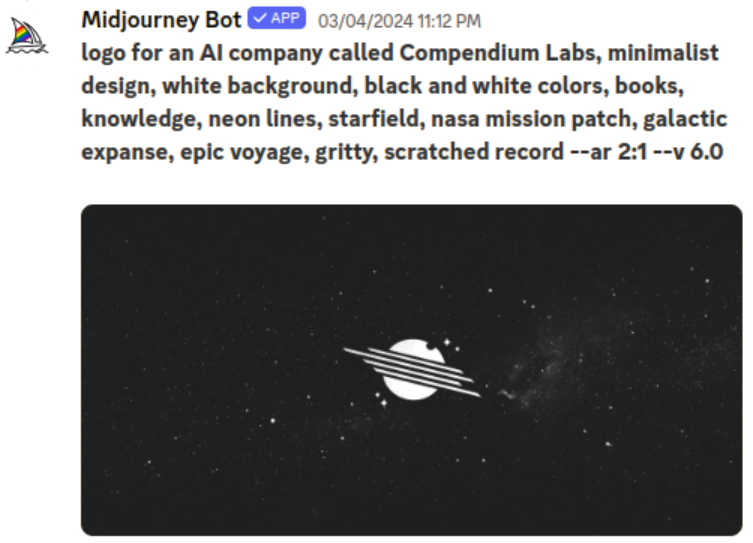
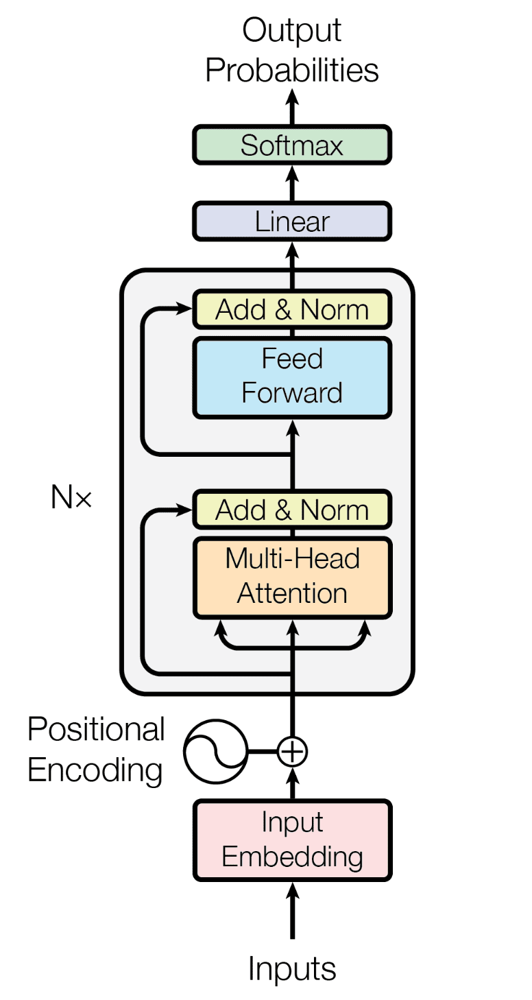
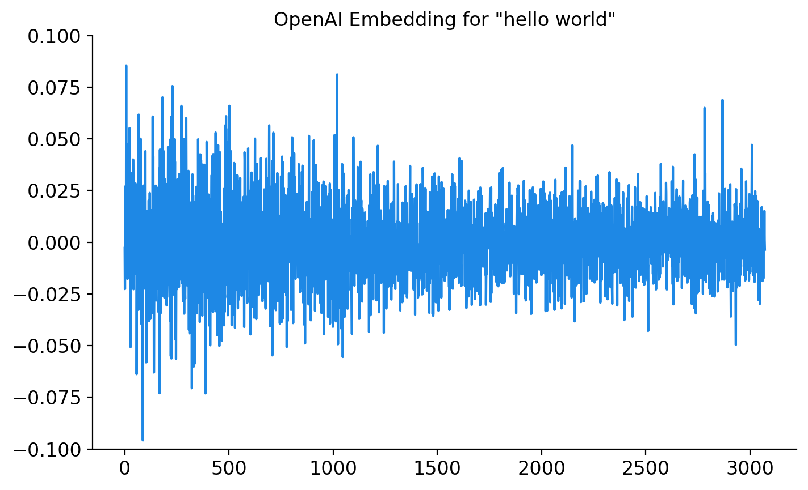
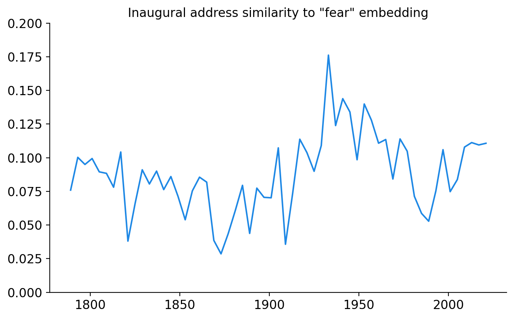
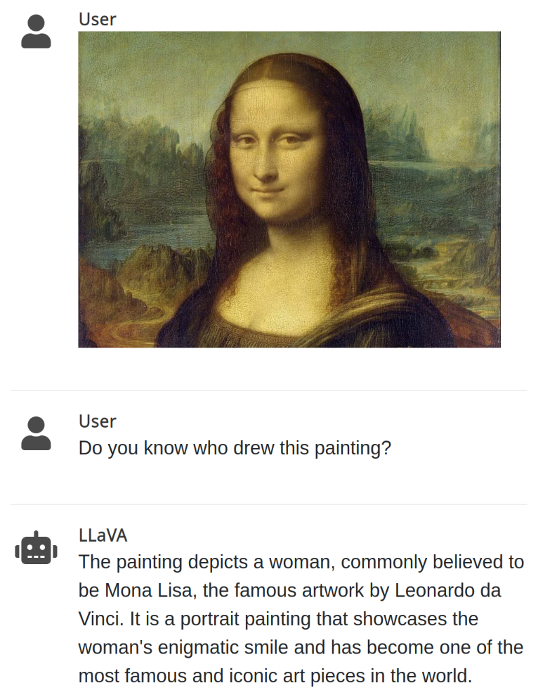

# Text Embeddings
## A Practical Overview

<br/>

### [Douglas Hanley](http://doughanley.com)
### University of Pittsburgh + [Compendium Labs](http://compendiumlabs.ai)

<br/>

##### OnX Maps Guest Lecture, 2024

[doughanley.com/embed](http://doughanley.com/embed)  <!-- .element style="color: #ff0d57" -->

---

## Recent Advances in ML + AI

There have been massive advances in the capabilities of frontier machine learning models, most notably in the generative space (text and/or images)

<div class="two-col">

<div class="col2">



</div>

<div class="col2">



</div>

</div>

---

## Transformer Architecture

<div class="two-col">

<div class="col2">

Transformers are the dominant class of large language model (LLM) today and are most notably used for ChatGPT and other models like LLaMa

There have been large improvements in architecture, training, and implementation since first proposed in 2017

The key component relative to standard neural networks is the **attention mechanism** which allows it to consider cross-word relationships with a relatively small number of parameters

</div>

<div class="col1">

 <!-- .element: style="width: 75%; margin-left: 50px;" -->

</div>

---

## Text Embedding Models

Any generative model will take some input (say a text prompt), convert it into an intermediate numerical representation, then use that to generate predictions that can be sampled from

**Text embedding models** omit the last step and focus only on generating the numerical representation
- Once we have this we can perform all sorts of simple calculations on the resulting vectors (like similarity)

Embedding models tend to be much lighter weight than generative models and so can be incorporated into existing workflows more easily

---

## Text Vectorization Historically

**Word frequency** (bag of words): identify relevant words (vocabulary) and produce a (very sparse) vector of counts/frequencies
- A common embellishment is to re-weight word frequencies by how common the word is ([TF-IDF](https://en.wikipedia.org/wiki/Tf–idf))

**Text embeddings**: converts words or documents into numerical representations that capture their semantic meaning
- Result is a high dimensional vector for each chunk of text (e.g. OpenAI offers models from 256 to 3072 dimensions)

*Token*: the fundamental "word" unit, usually a word or part of a word <br/>
*Sequence*: a list of tokens, like a sentence/paragraph/document <br/>
*Corpus*: a collection of documents, usually from the same source

---

## Transformers: A Closer Look

<script type="text/gum">
ND = t => Node(t, {aspect: 1, padding: 0.5});
TX = t => Place(Text(t), {aspect: 1, rad: [0.5, 0.15]});

let data = [
  [TX('the'), TX('quick'), TX('brown'), TX('fox')],
  [ND('e'), ND('e'), ND('e'), ND('e')],
  [ND('m'), ND('m'), ND('m'), ND('m')],
  [ND('b'), ND('b'), ND('b'), ND('b')],
  [ND('e'), ND('e'), ND('e'), ND('e')],
  [ND('d'), ND('d'), ND('d'), ND('d')],
]
let activ0 = VStack(data.map(HStack));
let activ = ['1', '2', 'N'].map(i => VStack([
  activ0, Node(`Layer ${i}`, {border: 0, aspect: 2.5})
]));

let arrow = Arrow(0, {pos: [1, 0.5], tail: 1, aspect: 1});
let shaft = Place(arrow, {aspect: 0.3, rad: 0.3});

let dot = Circle({rad: 0.25, fill: '#ccc'});
let etcet = Place(HStack([dot, dot, dot]), {aspect: 0.3});

let input = Place(Text("\"the quick brown fox\""), {rad: [0.5, 0.1], aspect: 0.6});
let output = Place(Text("\"jumps\""), {rad: [0.5, 0.1], aspect: 0.6});

let horiz = HStack([
  input, shaft,
  activ[0], shaft,
  activ[1], shaft,
  etcet, shaft,
  activ[2], shaft,
  output,
]);

let frame = Frame(horiz, {margin: 0.02});
let svg = SVG(frame, {size: 1000});
return svg;
</script>

Computational steps for a single pass of a transformer model:

- Tokenize input sequence and convert these into initial embeddings
- Apply N layers iteratively, each with "feed foward" and "attention" steps
- Use output from last token to synthesize a result (next word or embedding)

Important that attention can handle inputs sequences of arbitrary length!

---

## This Is An Embedding??

 <!-- .element: class="most center" -->

Dimensions are not interpretable... but seems like there's a Matryoshka pattern

---

## Visualizing Embeddings

<div class="two-col">

<div class="col1">

Let's get a more intuitive idea of what these embeddings express and how indicative they are of topic

We can also use **dimensionality reduction** techniques such as principle component analysis (PCA), t-SNE, or UMAP

Here is a 2D UMAP representation of the OpenAI embeddings for every presidential inaugural $\rightarrow$

</div>

<div class="col2" width="55%">

<iframe src="images/umap_inaug.html" width="520" height="520" scrolling="no"></iframe>


</div>

</div>

---

## Interactive UMAP (US Patents)

<iframe src="images/umap_patents.html" width="810" height="520"></iframe>

[Patents UMAP](umap_patents.html) (<span class="red">red</span> = old, <span class="blue">blue</span> = new)

---

## Uses of Text Embeddings

Generative models open up genuinely new capabilities (for most people). But these same models can be used to analyze existing data, not just generate "new" data

- **Retrieval**: embed docs and query them with a semantic interface
- **Classification**: embed docs and cluster them into categories
- **Recommendation**: combination of above geared towards consumer

Or we can combine the inference and generation for things like retrieval augmented generation (see RAG demo later)

---

## Retrieval: Vector Similarity

<div class="two-col">

<div class="col2" data-markdown>

Sentences with similar embeddings *should* have similar semantic meaning (models are trained to achieve this)
- this let's us do better than string matching because we can handle synonyms

Not perfect though, and often used in conjunction with string matching
- *dumbell problem*: saying you "love ice cream" and "hate ice cream" (??) could have similar embeds

</div>

<div class="col2" data-markdown>

<script type="text/gum">
ND = t => Node(t, {aspect: 1, padding: 0.5});
TX = t => Node(t, {aspect: 1, border: 0, padding: 0.2});
SP = m => repeat(Spacer({aspect: 1}), m);
SQ = m => repeat(Square(), m);
SP1 = Spacer({aspect: 1});
SQ1 = Square();
let data = [
  [...SP(7), TX('query'), ...SP(2), SP1],
  [SP1, ...SP(5), SP1, ND('e'), ...SP(2), SP1],
  [TX('doc 1'), ND('e'), ND('m'), ND('b'), ND('e'), ND('d'), SP1, ND('m'), SP1, ND('sim 1'), SP1],
  [TX('doc 2'), ND('e'), ND('m'), ND('b'), ND('e'), ND('d'), TX('×'), ND('b'), TX('='), ND('sim 2'), SP1],
  [TX('doc 3'), ND('e'), ND('m'), ND('b'), ND('e'), ND('d'), SP1, ND('e'), SP1, ND('sim 3'), SP1],
  [...SP(7), ND('d'), ...SP(2), SP1],
]
let grid = VStack(data.map(row => HStack(row)));
return Frame(grid, {margin: 0.02});
</script>

We can compute the similarity between embedded documents and a new query by doing a dot product (since the corpus is represented by a matrix of embeddings)

</div>

---

## Classification: Sentiment Analysis

One approach is to do "zero-shot" sentiment analysis by embedding a concept word (here "fear") and comparing to your corpus documents

 <!-- .element: class="most center" -->

---

## Embedding Providers

Many big players provide embedding APIs. Great because you can do it on almost any hardware

- **OpenAI**: Still great, has Matryoshka embeddings to reduce storage needs.
- **Cohere**: Very cool 1-bit quantization reduces storage needs.
- **Google**: Gecko models are competitive on performance metrics.

*Issues with proprietary*:

- What if they discontinue the model? Need to re-index all old documents with new models
- Rate limits can sometimes be an issue, but getting better over time

---

## Open Source Embeddings

[Huggingface](http://huggingface.co) is basically the GitHub of open-source ML models. Anything notable will find its way there

- **BAAI/bge-\***: great workhorse models, small compute (fast)
- **TaylorAI/bge-micro-v2**: super small with admirable performance
- **nomic** / **jina**: large context models, medium compute
- **GritLM** / **e5-mistral**: generative LLM based models, large compute

*Issues with open source*:
- Have to run it yourself or get someone to host it (software hassles, etc.)
- You'll want some kind of GPU or Apple workstation to run at scale

---

## Performance Considerations

Checkout the [MTEB leaderboard](https://huggingface.co/spaces/mteb/leaderboard). Also my [blog post](http://doughanley.com/blogs/?post=embed) on the Pareto frontier.
<script type="text/gum" width="65%">
let data = [
  {"Model":"all-MiniLM","Seqs":6064.483871,"Params":22.7,"MTEB":56.26,"xoff":0.0,"yoff":0.0,"font":12},
  {"Model":"bge-small","Seqs":3767.51503,"Params":33.4,"MTEB":62.17,"xoff":0.0,"yoff":0.0,"font":12},
  {"Model":"bge-base","Seqs":1516.120968,"Params":109,"MTEB":63.55,"xoff":70,"yoff":-0.02,"font":12},
  {"Model":"bge-micro","Seqs":8909.905213,"Params":17.4,"MTEB":56.57,"xoff":0.0,"yoff":0.0,"font":12},
  {"Model":"openai-large","Seqs":100,"Params":0,"MTEB":64.59,"xoff":0,"yoff":0.45,"font":12},
  {"Model":"T1","Seqs":133.3,"Params":10,"MTEB":64.59,"xoff":-300,"yoff":-0.3,"font":9},
  {"Model":"T3","Seqs":666.7,"Params":10,"MTEB":64.59,"xoff":-300,"yoff":-0.3,"font":9},
  {"Model":"T5","Seqs":1333.3,"Params":10,"MTEB":64.59,"xoff":-300,"yoff":-0.3,"font":9},
  {"Model":"openai-small","Seqs":100,"Params":0,"MTEB":62.26,"xoff":0,"yoff":0.45,"font":12},
  {"Model":"T1","Seqs":133.3,"Params":10,"MTEB":62.26,"xoff":-300,"yoff":-0.3,"font":9},
  {"Model":"T3","Seqs":666.7,"Params":10,"MTEB":62.26,"xoff":-300,"yoff":-0.3,"font":9},
  {"Model":"T5","Seqs":1333.3,"Params":10,"MTEB":62.26,"xoff":-300,"yoff":-0.3,"font":9},
];
let [xmin, xmax] = [0, 10000]; let [ymin, ymax] = [55, 65];
let [model, seqs, size, mteb, xoff, yoff, font] = zip(...data.map(d =>
  [d["Model"], d["Seqs"], d["Params"], d["MTEB"], d["xoff"], d["yoff"], d["font"]]
));
let scatter = Scatter(zip(seqs, mteb, size).map(([s, m, k]) =>
  [Dot(), [s, m], [120*sqrt(k)/10, sqrt(k)]]
));
let labels = Scatter(zip(model, seqs, mteb, xoff, yoff, font).map(([m, x, y, xo, yo, fs]) =>
  [Anchor(Text(m, {font_size: fs}), {align: 'right'}), [x+350+xo, y+0.03+yo]]
), {size: [160, 10]});
let plot = Plot([scatter, labels], {
  aspect: phi, xlim: [xmin, xmax], ylim: [ymin, ymax], yticks: 5,
  xlabel: 'Sequences / Second', ylabel: 'MTEB Score', title: 'Speed vs Performance',
  xlabel_offset: 0.15, ylabel_offset: 0.12, title_offset: 0.05,
  xlabel_font_size: 17, ylabel_font_size: 17, title_size: 0.09
});
let frame = Frame(plot, {padding: [0.25, 0.15, 0.15, 0.2]});
return frame;
</script>

---

## Embedding Tool Ecosystem

Almost everything happens through Python in ML these days
- and it's easier to learn than ever with ChatGPT and GitHub Copilot!

Set your `OPENAI_API_KEY` and run the following to get the embedding for one or many strings (here we just do "hello world")
```python
from openai import OpenAI
client = OpenAI(api_key=YOUR_API_KEY)
result = client.embeddings.create(
    input='hello world',
    model='text-embedding-3-large'
)
result.data[0].embedding # yields a list of 3072 numbers
```
See the full notebook for more examples: [slides.ipynb](https://github.com/iamlemec/embed/blob/main/code/slides.ipynb)

---

## Running Embeddings Locally

You can run embeddings locally even if you don't have a fancy GPU. Huggingface has excellent Python libraries for 

One of my favorite projects is `llama.cpp` which is a C++ implementation that keeps things fast and simple
```python
from llama_cpp import Llama
model = Llama('bge-large-en-v1.5-f16.gguf', embedding=True)
model.embed('hello world') # yields a big list of numbers
```
The GGUF file contains all the model specifications and weights. You can find GGUFs for a few popular embedding models at [Compendium Labs](https://huggingface.co/CompendiumLabs)

---

## Text Generation with LLMs

Of course, since they are the same architecture, you can do text generation with these same tools... but LLMs are much bigger models (see [slides.ipynb](https://github.com/iamlemec/embed/blob/main/code/slides.ipynb) for some generation examples)

Outside of ChatGPT style interfaces, there are quite a few other LLM use cases:

**Document annotation**: automatically classify or summarize documents on ingestion ("Does this document talk about X?")

**OCR Correction**: correct OCR transcriptions, which are often noisy or garbled

**Voice transcription**: Use `whisper.cpp` to transcribe audio in real-time

**Retrieval augmented generation**: combine embedding based retrieval with context aware LLMs

---

## Multi-modal models (Text + Image)

<div class="two-col">

<div class="col2" data-markdown>

**Image annotation**: [LlaVa](https://llava-vl.github.io/) can answer arbitrary questions about images

 <!-- .element: class="most" -->

</div>

<div class="col2" data-markdown>

**Text extraction / OCR**: [surya](https://github.com/VikParuchuri/surya) is pushing beyond classic OCR tools

 <!-- .element: class="full" -->

</div>

</div>

---

<div class="two-col">

<div class="col1">

<br/>

**Text Embeddings** <br/>
**A Practical Overview**

[Douglas Hanley](http://doughanley.com)

*University of Pittsburgh + [Compendium Labs](http://compendiumlabs.ai)*

<br/><br>

US patent embeddings $\rightarrow$

</div>

<div class="col2">

<br/>

<iframe src="images/umap_patents.html" width="810" height="520" scrolling="no"></iframe>

</div>

</div>
